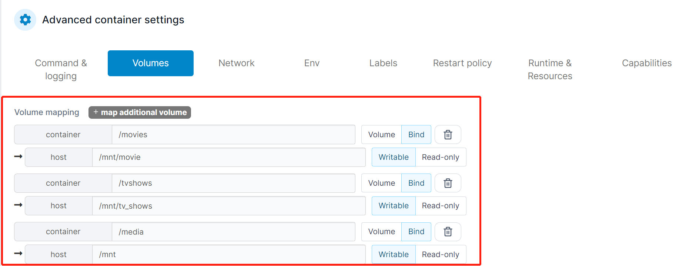

# LXC+Docker

## LXC+Docker套娃的原因

少量损失PVE性能的情况下，保证线程的稳定

## 创建CT

### 1、CT模板换源（宿主机）


宿主机，也就是PVE中，点选PVE-->shell中输入下列命令，皇位清华源


```
cp /usr/share/perl5/PVE/APLInfo.pm /usr/share/perl5/PVE/APLInfo.pm_back
sed -i 's|http://download.proxmox.com|https://mirrors.tuna.tsinghua.edu.cn/proxmox|g' /usr/share/perl5/PVE/APLInfo.pm
```

重启服务

```
systemctl restart pvedaemon.service
```

### 2、下载模板及创建


是在local（pve）中


2.1 选择`CT模板`，右侧上方的`模板`中选择需要下载的模板


此处以`debian-11-standard_11.3-1_amd64.tar.zst为例`


2.2 点击右上角 `创建CT` &#x20;


1、记住CT ID，该数字与conf文件有关

2、密码为登录该容器时候的root密码

3、主机名随意

4、去掉无特权的勾，即特权容器，便于挂载目录及Docker安装


<figure><figcaption><p>CT模板创建1</p></figcaption></figure>

<figure><figcaption><p>选择使用的CT模板</p></figcaption></figure>

<figure><figcaption><p>设置磁盘大小</p></figcaption></figure>


可以设置大一点，这个空间是动态的，并不实际占用

尤其是涉及到Transmission等容器，因为挂载目录后，实际是先下载到容器中，再转存到挂载目录的


<figure><figcaption></figcaption></figure>

<figure><figcaption></figcaption></figure>


关于核心数、内存、swap：我的理解为和空间一样，也是动态分配的，多给一点，没关系


<figure><figcaption></figcaption></figure>


左边关于虚拟网桥部分不用动

右边一般使用静态，便于后期容器内设备的登录等；注意后面的<mark style="color:red;">`/24`</mark> 部分，


<figure><figcaption></figcaption></figure>


网络部分，我的主路由是192.168.10.1，所以静态地址选用了192.168.10.198，建议家庭内使用，就改变最后一段，也就是192.168.10.X，前面部分需要根据实际局域网来设定。DNS指向主路由IP。


命令行出现`Task OK` 即可关闭。
